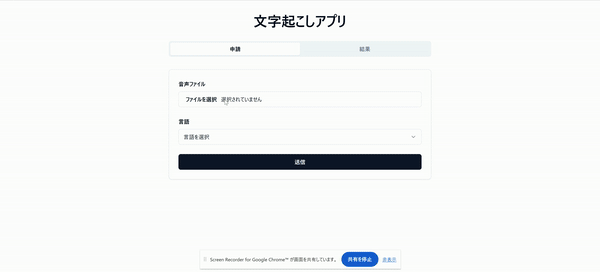
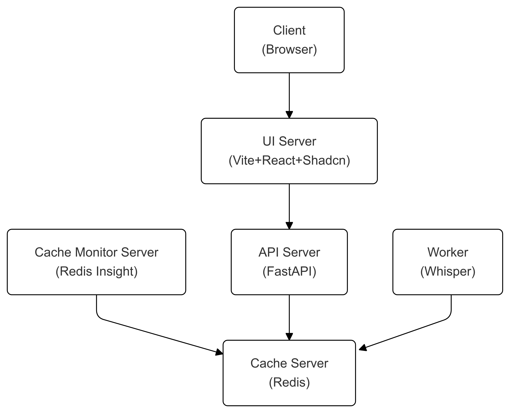

## About

Local Transcription Web App



## How to use

### Required

- docker
- nvidia-driver
- nvidia-container-toolkit

### Start services

1. Create .env file

2. Start services

```bash
docker compose up -d
```

### Access UI server

```bash
# UI-SERVER-PORT: you can set at .env
http://localhost:UI-SERVER-PORT/
```

### Access cache monitor server

1. Access the following url

```url
# CACHE-SERVER-MONITOR-PORT: you can set at .env
http://localhost:CACHE-SERVER-MONITOR-PORT/
```

2. Click "Add database"
3. Enter the following items

```
Host: cache-server-container
Username: default
Password: CACHE_SERVER_PASSWORD (you can set at .env)
```

## System Diagram


